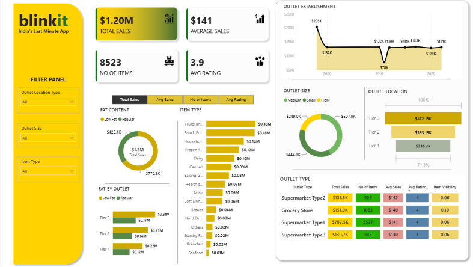

🛒 Blinkit Sales Analysis Dashboard 2024

📌 Project Overview
This project presents an interactive Power BI dashboard built using the Blinkit Grocery Sales dataset. The dashboard provides insights into sales performance, customer preferences, outlet characteristics, and product categories to support business decision-making through data visualization.

🎯 Objectives
Analyze overall sales performance.
Identify top-performing product categories.
Compare sales across different outlet types and locations.
Understand customer purchasing trends.
Build an interactive dashboard for business insights.

🛠️ Tools & Technologies
Power BI
Microsoft Excel
Power Query
DAX (Data Analysis Expressions)
Data Cleaning & Transformation

📂 Dataset
The dataset contains information about:
Item Type
Item Fat Content
Outlet Size
Outlet Location
Outlet Type
Establishment Year
Sales
Ratings
Visibility
Weight

📊 Dashboard Features
Total Sales Analysis
Average Sales
Number of Items Sold
Average Rating
Sales by Item Type
Sales by Fat Content
Sales by Outlet Size
Sales by Outlet Location
Sales by Outlet Type
Outlet Establishment Trend
Interactive Filters (Slicers)

📈 Key Insights
Identified the highest revenue-generating product categories.
Compared outlet performance based on size and location.
Analyzed customer preferences for low-fat and regular products.
Evaluated sales trends across different outlet establishment years.
Built interactive visualizations to support data-driven business decisions.

📁 Repository Structure
Blinkit-Sales-Analysis-Dashboard-2024/
│
├── Dashboard/
│   └── Blinkit_Sales_Analysis_Dashboard.pbix
│
├── Dataset/
│   └── BlinkIT Grocery Data.xlsx
│
├── Images/
│   ├── Dashboard.png
│   ├── Sales_Overview.png
│   ├── Outlet_Analysis.png
│   └── Item_Analysis.png
│
└── README.md

🚀 How to Use
Download or clone this repository.
Open the .pbix file using Microsoft Power BI Desktop.
Explore the interactive dashboard.
Apply filters to analyze different business scenarios.

📷 Dashboard Preview

💡 Skills Demonstrated
Data Cleaning
Data Transformation
Data Visualization
Business Intelligence
Dashboard Design
DAX Calculations
Analytical Thinking
KPI Reporting

📬 Connect With Me
Akansha Walia
GitHub: https://github.com/akanshawalia10-eng
LinkedIn: https://www.linkedin.com/in/akansha-walia/
